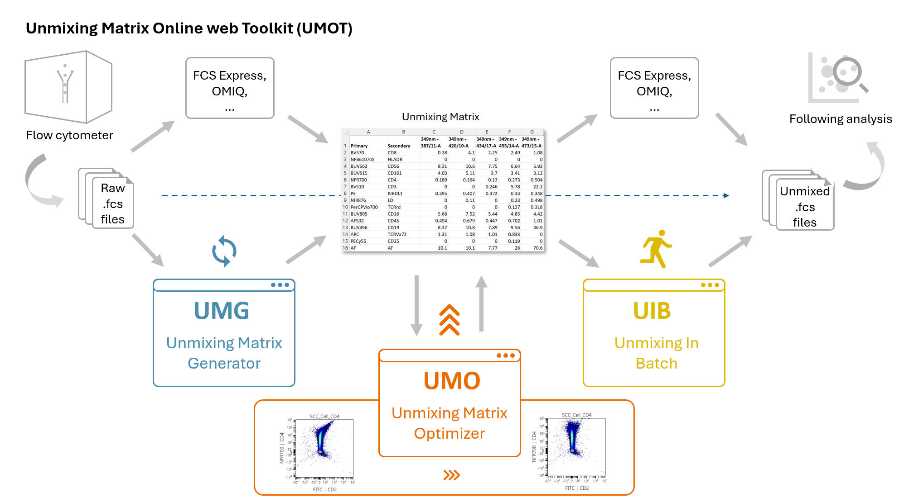

# UMOT
Unmixing Matrix Online web Toolkit for flow cytometry

  

Unmixing is a key step of spectral flow cytometry, and a unmixing matrix is the matrix containing signatures of fluors and autofluorescences. UMOT is developed to address the unmixing issues, which is caused by the mismatch between extracted signatures and "real" signatures in multi-color samples.

The UMOT includes 3 out-of-the-box webtools:
1. [Unmixing Matrix Generator (UMG)](https://github.com/xiangmingcai/UnmixingMtxGenerator.github.io/tree/main): generate unmixing matrix from raw fcs files.
2. [Unmixing Matrix Optimizer (UMO)](https://github.com/xiangmingcai/UnmixingMtxOptimizer.github.io): correct unmixing matrix to address unmixing issues.
3. [Unmixing In Batch (UIB)](https://github.com/xiangmingcai/UnmixingInBatch.github.io): do unmixing on raw fcs files to obtain unmixed fcs files in batch.

The UMG could be very helpful for users to generate an unmixing matrix in ~ 30 mins to 1 hour, since most flow cytometers do not allow exporting unmixing matrix. 

**The UMO is the core module of the UMOT toolkit.** In fact, both UMG and UIB are designed to support the use of UMO. The UMG is both powerful and user-friendly in addressing most unmixinng issues. The algorithm of UMO will be released in our paper, which in ongoing...

Although we provide BIU as an unmixing tool, browser environment is not really an ideal choice for such highly calculation intensive work. If you have big fcs file (>100 Mb), you could also do unmixing in [OMIQ](https://help.omiq.ai/hc/en-us/articles/28937155541908-Create-and-Apply-a-Spectral-Unmixing-Matrix) or [FCS Express](https://denovosoftware.com/full-access/features/spectral-unmixing/). 

Note: UMOT is complete static, meaning everything you do with UMOT is 100% local.** No data is sent out, and we do not store any user information.

If you find it helpful, please remember to cite us in your work. 

author : Xiangming Cai

email : x.cai@amsterdamumc.nl

time : 2025/4/6

version: v1.0
